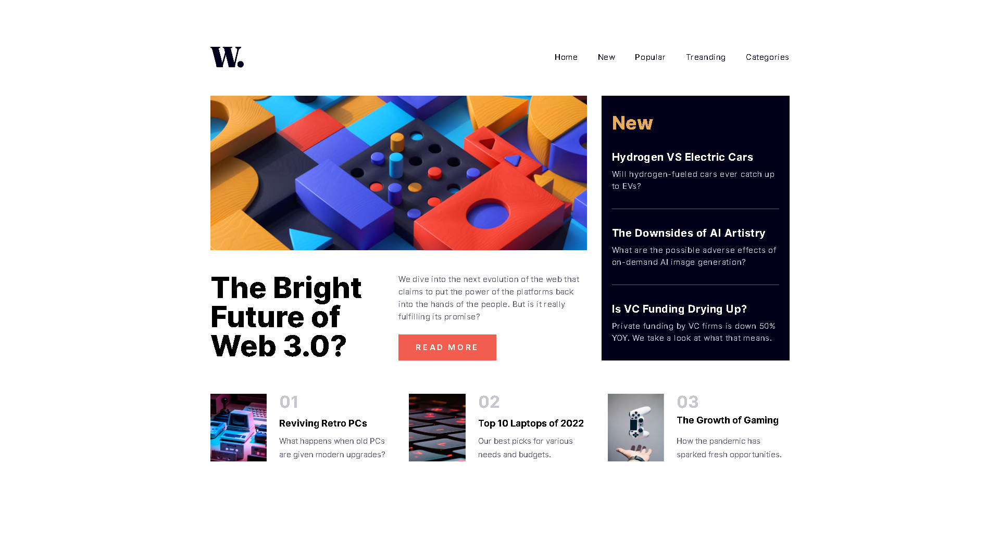

# Frontend Mentor - News homepage solution

This is a solution to the [News homepage challenge on Frontend Mentor](https://www.frontendmentor.io/challenges/news-homepage-H6SWTa1MFl). Frontend Mentor challenges help you improve your coding skills by building realistic projects.

## Table of contents

- [Overview](#overview)
  - [The challenge](#the-challenge)
  - [Screenshot](#screenshot)
  - [Links](#links)
- [My process](#my-process)
  - [Built with](#built-with)
  - [What I learned](#what-i-learned)
- [Author](#author)

**Note: Delete this note and update the table of contents based on what sections you keep.**

## Overview

### The challenge

Users should be able to:

- View the optimal layout for the interface depending on their device's screen size
- See hover and focus states for all interactive elements on the page

### Screenshot

  ### Links

- Live Site URL: [live site URL here](https://helpful-bavarois-bbd26d.netlify.app/)

## My process

- Setup Project with Vite
- Install Taillwind css

### Built with

- Semantic HTML5 markup
- CSS custom properties
- Flexbox
- CSS Grid

### What I learned

ลองพยายามทบทวน Tailwind css อีกครั้ง

## What problem in project

- naming :(
- Setup Project

## Author

- Frontend Mentor - [@Sitthisak Intharak](https://www.frontendmentor.io/profile/Sittisukintaruk)
